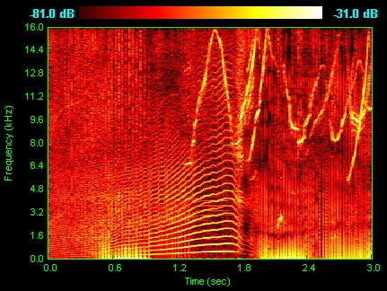
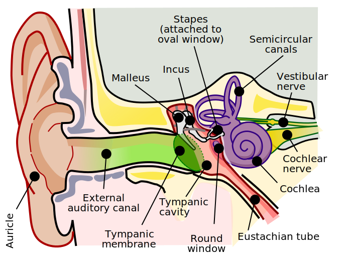

| Group 1 | Group 2 | Group 3 | Group 4| Group 5 | Group 6 |
|---|---|---|---|---|---|
| Finch | Oliver P. | Prady | Marin | Walker | Irys |
| Dennis | Kai | Ethan | Izzy | Nat | Kari |
| Zander | AJ | Elijah | Sylvia | Tristan | Finley |
| Luka | Jack | Rachel | RJ | Louis | Rachel |

# Announcements
- Check 22 retakes by this Thursday at 3:35pm
- Check 23 retakes by this Friday at 3:35pm
- Homework problems can be found at the end of today's notes. Due Friday

<!--Bell Ringer Choose a Random Sentence -->

---

# Spectrograms

 [Spectrogram Website](https://spectrogram.sciencemusic.org/)
<!-- for each group a representative reads the sentence into the spectrogram -->
<!-- you play cello -->
<!-- students discuss what is being depicted in the spectrogram -->

---
# Discuss
 * What is going here?
 * What is sound?

---
# What is Sound?
<figure>

<figcaption> Cochlea (left), Organ of Corti (right) . CC license from wikipedia </figcaption>
</figure>

---
# Fourier Analysis

Any (piecewise) continuous function can be approximated as a Fourier series

$$
s(t) = \underbrace{\sum_{k=0}^{\infty} c_k \cos(kt)}_{\text{even}} + \underbrace{\sum_{k=1}^\infty s_k \sin(kt)}_{\text{odd}}
$$

---
# Fourier Transform
Given a function, $s(t)$, we can compute the Fourier coefficents via the Fourier transform

$$
\begin{align}
c_0 &= \frac{1}{2\pi} \int_{-\pi}^\pi s(\tau) d\tau\\
c_k &= \frac{1}{\pi} \int_{-\pi}^\pi s(\tau) \cos(k\tau) d\tau \\
s_k &= \frac{1}{\pi} \int_{-\pi}^\pi s(\tau) \sin(k\tau) d\tau
\end{align}
$$

---
# Example

Consider the function
$$
f(x) = \begin{cases}
    1 & \text{for } 0 < x < \pi \\
    -0.5 & \text{for } -\pi < x \leq 0
\end{cases}
$$

Let's compute a 6th order Fourier Approximation

[Desmos link](https://www.desmos.com/calculator/oxqby80vki)
<!-- group k computes the kth Fourier coefficients-->

---

## Power Spectrum

The power spectrum of a signal, $f(t)$, is the function

$$
P[k] = c_k^2 + s_k^2
$$

where $c_k, s_k$ are the Fourier coefficients of $f$.

---

## Discuss
- [What is going on here?](https://spectrogram.sciencemusic.org)
- What is sound?
