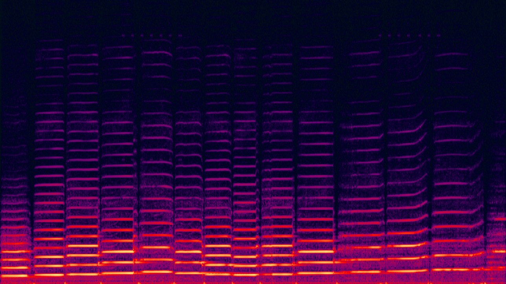
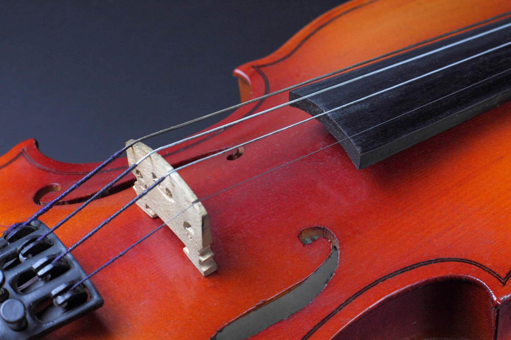

# Announcements
- The Juniors are my favorite students.
- Check 23 retake due today at 3:35pm

# Bell-ringer (5 minutes)

Imagine an elastic string that is pinned at both ends on the interval $[-\pi, \pi]$.  The deviation of the string from a straight line can be modelled with a function $h(x)$.  Let's
say $h(x) = \sin(kx)$.

- What can $k$ be?
- What can't $k$ be? Why?

<!-- have the students figure this out for themselves-->

---

# Goal

On the left is a spectrogram of a violin
We would like to understand the striation patterns

[watch this video](https://www.youtube.com/embed/6JeyiM0YNo4?si=iBHws45iXrHiIzNL)

<!-- 5 minutes -->
---

# Modelling a violin string

Let's model the deviation of the string as a function of space and time, $h(x,t)$.

<!-- 10 minute walk through the process of going from a function of space to a function of space time starting at t=0 -->

---

# The wave equation

$$
\frac{\partial^2 h}{\partial t^2} = \kappa \frac{\partial^2 h}{\partial x^2}
$$

<!-- 5 minutes You will need to explain the notion of a partial derivative-->
<!-- 5 minutes You will also need to explain how this is physically justified.  Do this with a picture-->

---

# Question
Assume

$$
  h(x,t) = s(t) \sin(nx)
$$
for some fixed $n$.
Can we choose $s(t)$ so that $h(x,t)$ satisfies the wave equation?

<!-- Check students understand the question (5 minutes) -->

---

# Answer (yes)

$h(x,t)$ satisfies the wave equation if (and only if)

$$
    \frac{d^2 s}{dt^2} = -\kappa n^2 s
$$
for $n=1,2,\dots$

This is a differential equation of a single variable!
Can we solve it?

<!-- See if the students can solve this (2 minutes) -->

---

# Solution
If
$$
s(t) = A \cos(n\sqrt{\kappa} \cdot t) + B \sin(n \sqrt{\kappa} \cdot t)
$$
then 
$$
h(x,t) = s(t) \sin(nx)
$$
satisfies the wave equation

$$
\frac{\partial^2 h}{\partial t^2} = \kappa \frac{\partial^2 h}{\partial x^2}
$$

<!-- You should have 15-20 minutes left -->

---

# Linearity
If we have two such solutions
$$
\begin{align}
    h_n(x,t) &= s_n(t) \sin(nx) \\
    h_m(x,t) &= s_m(t) \sin(mx)
\end{align}

$$
Then does
$$
    h(x,t) = h_n(x,t) + h_m(x,t)
$$
satisfy the wave equation?

---
# General solution of the wave equation

$$
    h(x,t) = \sum_{k=1}^{\infty} s_n(t) \sin(nx)
$$
where
$$
    s_n(t) = A_n \cos(n\sqrt{\kappa} \cdot t) + B_n \sin(n \sqrt{\kappa} \cdot t)
t
$$

<!-- note how the only oscillations we see in time are integers multiples of root(kappa)-->

---

# Goal

On the left is a spectrogram of a violin
We would like to understand the striation patterns

[watch this video](https://www.youtube.com/embed/6JeyiM0YNo4?si=iBHws45iXrHiIzNL)

